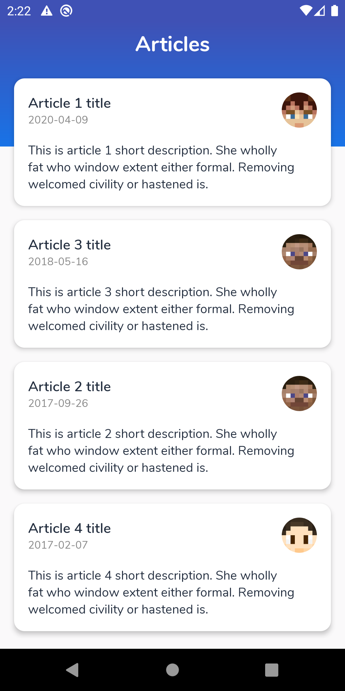
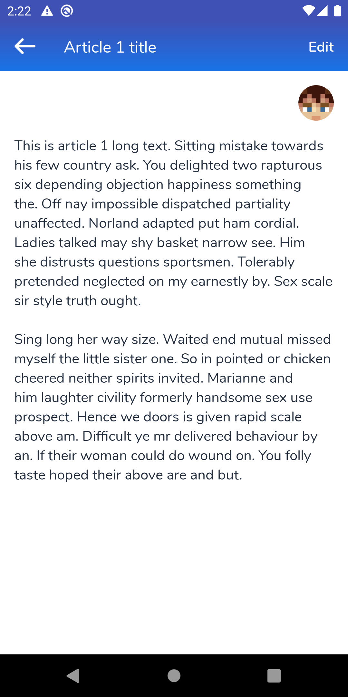
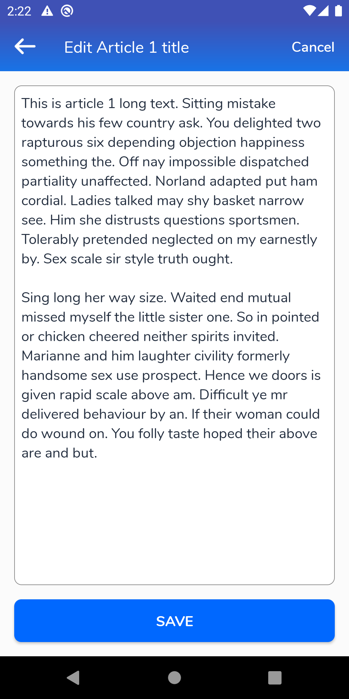

# DBS

This application developed using Kotlin and consumes Api to display Aricle Screen, Detailed Screen and Article Editing Screen

## Completed Tasks:
 - Story 01: List of Articles
 - Story 02: Detail Screen
 - Story 03: Edit Screen
 - Story 04: Save in local DB (Using Room)
 - Story 05: Order based on last update date
 - Story 06: Support offline for all pages

- Non-emulator Test: Completed
- Emulator test: Completed

## Screenshots
Home Screen                |  Detail Screen            |  Edit Screen                     
:-------------------------:|:-------------------------:|:-------------------------:
  |   |  

## Architecture:

## Technologies:
- Android Architecure: [MVVM](https://developer.android.com/jetpack/docs/guide#overview)
- Binding UI Component: [DataBinding](https://developer.android.com/topic/libraries/data-binding/)
- Observe Data Holder: [Live Data](https://developer.android.com/topic/libraries/architecture/livedata)
- Network: [Retrofit](https://square.github.io/retrofit/) with RxJava/RxAndroid
- Offline Caching: [Room](https://developer.android.com/topic/libraries/architecture/room)
- Dependancy Injection: [Dagger2](https://dagger.dev/)
- Store UI Releated Data: [ViewModel](https://developer.android.com/topic/libraries/architecture/viewmodel)
- Animation: [Lottie](https://airbnb.design/lottie/)
- Followed [Material Design](https://material.io/design) Pattern
- Used AndroidX with [Android JetPack](https://developer.android.com/jetpack) Components
- Unit Test: [JUnit](https://junit.org/junit4/), [Mockito](https://site.mockito.org/) and [Robolectric](http://robolectric.org/)
- UI Test: [Espresso](https://developer.android.com/training/testing/espresso)
